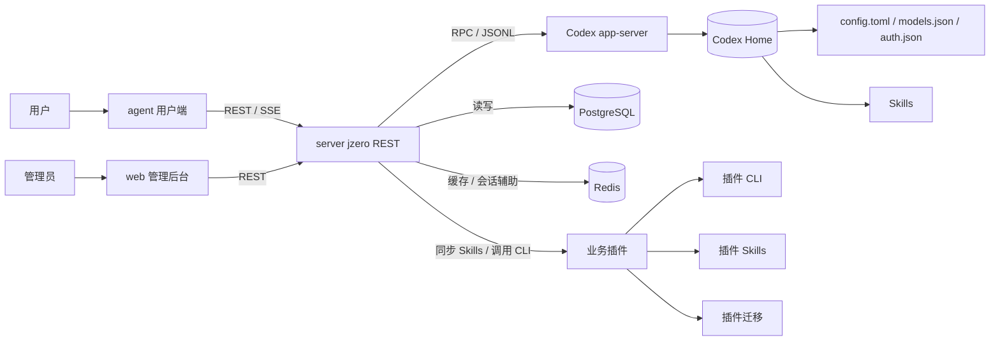

# 系统架构

AgentRazor 由用户端、管理端、服务端、Codex app-server、插件系统和基础设施组成。

## 核心链路

1. 用户在 `agent` 中登录并发送消息。
2. `server` 验证用户身份，创建或恢复 Codex thread。
3. `server` 调用 Codex app-server 启动 turn。
4. Codex app-server 持续返回过程事件、工具调用、消息 delta 和完成事件。
5. `server` 通过 SSE 把事件转发给前端，同时记录必要的 Token 用量和会话状态。
6. `agent` 将事件合并为稳定的过程展示和最终回答。

## 为什么服务端托管 app-server

服务端托管 app-server 可以统一解决这些问题：

- 用户认证和权限控制。
- 多会话元数据管理。
- SSE 断线重连和事件缓存。
- app-server 重启和运行状态管理。
- 插件 Skills 同步和业务 CLI 接入。
- Token 用量记录和运营指标。
