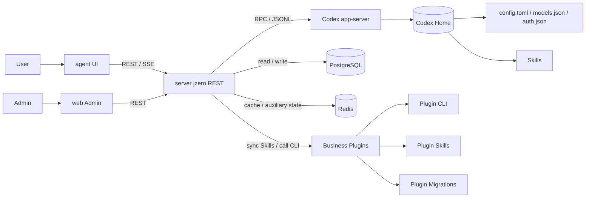

# Architecture

AgentRazor consists of the Agent UI, admin console, server, Codex app-server, plugin system, and infrastructure.

## Core Flow

1. A user logs in and sends a message in `agent`.
2. `server` validates identity and creates or resumes a Codex thread.
3. `server` starts a turn through Codex app-server.
4. Codex app-server streams process events, tool calls, message deltas, and completion events.
5. `server` forwards events through SSE and records necessary token usage and conversation state.
6. `agent` merges events into stable process display and final answers.
